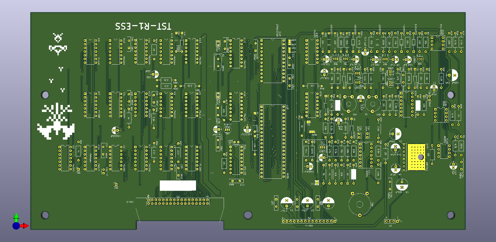
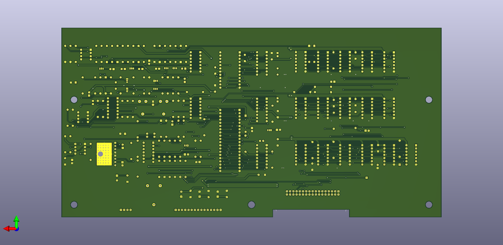

# Space Firebird Soundboard Reproduction
This was my attempt at making a reproduction sound board for Space Firebird. It is a pretty fun game but I was having problems finding the sound boards. This reproduction board is not a 1:1 recreation, that would be silly. But it should fit in an original cocktail table or upright but that is not confirmed. I have a couple quality of life improvements, like for example all axial capacitors have been replaced with radials. I also used copper pours for the grounding in this. It does roughly follow the original layout however. These are not going to be really for sale by myself, which is why I am uploading the files so you can make your own!

**Status**: Prototype PCBs were assembled and tested as functional.

## Schematic Notes
Believe it or not, there were actually a couple of mistakes in the original schematics. The first one is IC12 pin 13. In the original schematics, it connects to pin 6 of IC9, this is incorrect, it should be connected to pin 4. Another thing I corrected is in later revisions of the sound board, they added two capacitors to the clear lines on the 74ls164s. Some older revisions have these capacitors hacked on, I went ahead and added them so hacks aren't necessary. One final thing I changed is if I read the schematics right, it was originally strapped for 2708 eproms, I changed the default to 2716 as those are much easier to program for.

## Images
**Front Render**   

**Back Render**  

**Prototype PCB Front**  

**Prototype PCB Back**  

## Bill of Materials
Most parts that are used on this sound board are off the shelf componts that are still made today. The only ones you might have a problem with are the eprom (strapped for 2716 by default), the 8035 CPU, CA3080E, and MB3712. Some components are not populated. X1, C47, C48, R48, R49, and R53 are not supposed to be populated. Some components are being substituted, for example: 1ss53 diodes are being substituted for 1N4148. 

|Item                  |Qty  |Reference(s)                                                                                                |Value              |LibPart                              |Footprint                                                                       |
|-----|-------|-----------|---------|----------|-------|
|1                     |5    |C1, C2, C3, C4, C45                                                                                         |220uF              |Device:CP                            |Capacitors_THT:CP_Radial_D8.0mm_P3.80mm                                         |
|2                     |1    |C5                                                                                                          |220uf              |Device:CP                            |Capacitors_THT:CP_Radial_D8.0mm_P3.80mm                                         |
|3                     |2    |C6, C44                                                                                                     |47uF               |Device:CP                            |Capacitors_THT:CP_Radial_D6.3mm_P2.50mm                                         |
|4                     |4    |C7, C8, C49, C50                                                                                            |22uF               |Device:CP                            |Capacitors_THT:CP_Radial_D5.0mm_P2.50mm                                         |
|5                     |2    |C9, C10                                                                                                     |10uF               |Device:CP                            |Capacitors_THT:CP_Radial_D5.0mm_P2.50mm                                         |
|6                     |1    |C11                                                                                                         |4.7uF              |Device:CP                            |Capacitors_THT:CP_Radial_D5.0mm_P2.50mm                                         |
|7                     |2    |C12, C13                                                                                                    |3.3uF              |Device:CP                            |Capacitors_THT:CP_Radial_D5.0mm_P2.50mm                                         |
|8                     |8    |C14, C15, C16, C17, C18, C19, C20, C21                                                                      |1uF                |Device:CP                            |Capacitors_THT:CP_Radial_D5.0mm_P2.50mm                                         |
|9                     |1    |C22                                                                                                         |1nF                |Device:C                             |Capacitors_THT:C_Disc_D3.8mm_W2.6mm_P2.50mm                                     |
|10                    |1    |C23                                                                                                         |22nF               |Device:C                             |Capacitors_THT:C_Disc_D3.8mm_W2.6mm_P2.50mm                                     |
|11                    |3    |C24, C25, C26                                                                                               |10nF               |Device:C                             |Capacitors_THT:C_Disc_D3.8mm_W2.6mm_P2.50mm                                     |
|12                    |18   |C27, C28, C29, C30, C31, C32, C33, C34, C35, C36, C37, C38, C39, C40, C41, C42, C43, C46                    |68nF               |Device:C                             |Capacitors_THT:C_Disc_D10.0mm_W2.5mm_P5.00mm                                    |
|13                    |2    |C47, C48                                                                                                    |30pF               |Device:C                             |Capacitors_THT:C_Disc_D3.4mm_W2.1mm_P2.50mm                                     |
|14                    |12   |D1, D2, D3, D4, D5, D6, D7, D8, D9, D10, D11, D12                                                           |1SS53 (1N4148)     |Device:D                             |Diodes_THT:D_DO-35_SOD27_P12.70mm_Horizontal                                    |
|15                    |3    |IC1, IC2, IC13                                                                                              |74LS04             |74xx:74LS04                          |Housings_DIP:DIP-14_W7.62mm                                                     |
|16                    |1    |IC3                                                                                                         |74LS00             |74xx:74LS00                          |Housings_DIP:DIP-14_W7.62mm                                                     |
|17                    |3    |IC4, IC5, IC6                                                                                               |74LS10             |74xx:74LS10                          |Housings_DIP:DIP-14_W7.62mm                                                     |
|18                    |1    |IC7                                                                                                         |74LS86             |74xx:74LS86                          |Housings_DIP:DIP-14_W7.62mm                                                     |
|19                    |1    |IC8                                                                                                         |74LS02             |74xx:74LS02                          |Housings_DIP:DIP-14_W7.62mm                                                     |
|20                    |1    |IC9                                                                                                         |74LS30             |74xx:74LS30                          |Housings_DIP:DIP-14_W7.62mm                                                     |
|21                    |1    |IC10                                                                                                        |74LS74             |74xx:74LS74                          |Housings_DIP:DIP-14_W7.62mm                                                     |
|22                    |5    |IC11, IC12, IC14, IC15, IC16                                                                                |74LS164            |Custom_Symbols:74LS164               |Housings_DIP:DIP-14_W7.62mm                                                     |
|23                    |2    |IC17, IC18                                                                                                  |74LS75             |74xx:74LS75                          |Housings_DIP:DIP-16_W7.62mm                                                     |
|24                    |1    |IC19                                                                                                        |TST-8035           |Custom_Symbols:TST-8035              |Housings_DIP:DIP-40_W15.24mm_Socket                                             |
|25                    |1    |IC20                                                                                                        |TST-2708           |Custom_Symbols:TST-2716              |Housings_DIP:DIP-24_W15.24mm_Socket                                             |
|26                    |1    |IC21                                                                                                        |TST-DAC08          |Custom_Symbols:TST-DAC08             |Housings_DIP:DIP-16_W7.62mm_Socket                                              |
|27                    |2    |IC22, IC23                                                                                                  |74LS05             |74xx:74LS05                          |Housings_DIP:DIP-14_W7.62mm                                                     |
|28                    |2    |IC24, IC27                                                                                                  |LM324A             |Amplifier_Operational:LM324A         |Housings_DIP:DIP-14_W7.62mm_Socket                                              |
|29                    |2    |IC25, IC26                                                                                                  |TST-3080           |Custom_Symbols:TST-3080              |Housings_DIP:DIP-8_W7.62mm_Socket                                               |
|30                    |1    |IC28                                                                                                        |TST-MB3712         |Custom_Symbols:TST-MB3712            |Custom Footprints:MB3712                                                        |
|31                    |1    |IC29                                                                                                        |TST-NE555          |Custom_Symbols:TST-NE555             |Housings_DIP:DIP-8_W7.62mm                                                      |
|32                    |3    |JP1, JP2, JP3                                                                                               |Jumper_3_Bridged12 |Jumper:Jumper_3_Bridged12            |Jumpers:SolderJumper-3_P1.3mm_Bridged12_RoundedPad1.0x1.5mm_NumberLabels        |
|33                    |4    |JP4, JP5, JP6, JP7                                                                                          |Jumper_2_Bridged   |Jumper:Jumper_2_Bridged              |Jumpers:SolderJumper-2_P1.3mm_Bridged_RoundedPad1.0x1.5mm                       |
|34                    |1    |P1                                                                                                          |Conn_01x04         |Connector_Generic:Conn_01x04         |Pin_Headers:Pin_Header_Straight_1x04_Pitch2.54mm                                |
|35                    |1    |P2                                                                                                          |Conn_01x15         |Connector_Generic:Conn_01x15         |Pin_Headers:Pin_Header_Straight_1x15_Pitch2.54mm                                |
|36                    |1    |P3                                                                                                          |Conn_02x17_Odd_Even|Connector_Generic:Conn_02x17_Odd_Even|Custom Footprints:34_right_angle_ribbon                                         |
|37                    |1    |R1                                                                                                          |3.3M               |Device:R                             |Custom Footprints:R_Axial_DIN0309_L7.0mm_D3.2mm_P12.70mm_Horizontal             |
|38                    |1    |R2                                                                                                          |30k                |Device:R                             |Custom Footprints:R_Axial_DIN0309_L7.0mm_D3.2mm_P12.70mm_Horizontal             |
|39                    |1    |R3                                                                                                          |470k               |Device:R                             |Custom Footprints:R_Axial_DIN0309_L7.0mm_D3.2mm_P12.70mm_Horizontal             |
|40                    |3    |R4, R5, R6                                                                                                  |200k               |Device:R                             |Custom Footprints:R_Axial_DIN0309_L7.0mm_D3.2mm_P12.70mm_Horizontal             |
|41                    |3    |R7, R8, R9                                                                                                  |100k               |Device:R                             |Custom Footprints:R_Axial_DIN0309_L7.0mm_D3.2mm_P12.70mm_Horizontal             |
|42                    |3    |R10, R15, R20                                                                                               |47k                |Device:R                             |Custom Footprints:R_Axial_DIN0309_L7.0mm_D3.2mm_P12.70mm_Horizontal             |
|43                    |6    |R11, R44, R45, R46, R47, R50                                                                                |4.7k               |Device:R                             |Custom Footprints:R_Axial_DIN0309_L7.0mm_D3.2mm_P12.70mm_Horizontal             |
|44                    |3    |R12, R13, R14                                                                                               |20k                |Device:R                             |Custom Footprints:R_Axial_DIN0309_L7.0mm_D3.2mm_P12.70mm_Horizontal             |
|45                    |22   |R16, R17, R18, R22, R23, R24, R25, R26, R27, R28, R29, R30, R31, R32, R33, R34, R35, R36, R37, R42, R43, R62|10k                |Device:R                             |Custom Footprints:R_Axial_DIN0309_L7.0mm_D3.2mm_P12.70mm_Horizontal             |
|46                    |7    |R19, R21, R41, R60, R61, R65, R69                                                                           |1k                 |Device:R                             |Custom Footprints:R_Axial_DIN0309_L7.0mm_D3.2mm_P12.70mm_Horizontal             |
|47                    |3    |R38, R39, R40                                                                                               |5.6k               |Device:R                             |Custom Footprints:R_Axial_DIN0309_L7.0mm_D3.2mm_P12.70mm_Horizontal             |
|48                    |2    |R48, R49                                                                                                    |1                  |Device:R                             |Custom Footprints:R_Axial_DIN0309_L7.0mm_D3.2mm_P12.70mm_Horizontal             |
|49                    |1    |R51                                                                                                         |3k                 |Device:R                             |Custom Footprints:R_Axial_DIN0309_L7.0mm_D3.2mm_P12.70mm_Horizontal             |
|50                    |3    |R52, R68, R70                                                                                               |2k                 |Device:R                             |Custom Footprints:R_Axial_DIN0309_L7.0mm_D3.2mm_P12.70mm_Horizontal             |
|51                    |1    |R53                                                                                                         |0                  |Device:R                             |Custom Footprints:R_Axial_DIN0309_L7.0mm_D3.2mm_P12.70mm_Horizontal             |
|52                    |6    |R54, R55, R56, R57, R58, R59                                                                                |2.2k               |Device:R                             |Custom Footprints:R_Axial_DIN0309_L7.0mm_D3.2mm_P12.70mm_Horizontal             |
|53                    |1    |R63                                                                                                         |6.2k               |Device:R                             |Custom Footprints:R_Axial_DIN0309_L7.0mm_D3.2mm_P12.70mm_Horizontal             |
|54                    |1    |R64                                                                                                         |330                |Device:R                             |Custom Footprints:R_Axial_DIN0309_L7.0mm_D3.2mm_P12.70mm_Horizontal             |
|55                    |1    |R66                                                                                                         |1.2k               |Device:R                             |Custom Footprints:R_Axial_DIN0309_L7.0mm_D3.2mm_P12.70mm_Horizontal             |
|56                    |1    |R67                                                                                                         |470                |Device:R                             |Custom Footprints:R_Axial_DIN0309_L7.0mm_D3.2mm_P12.70mm_Horizontal             |
|57                    |1    |R71                                                                                                         |3.3k               |Device:R                             |Custom Footprints:R_Axial_DIN0309_L7.0mm_D3.2mm_P12.70mm_Horizontal             |
|58                    |1    |R72                                                                                                         |20                 |Device:R                             |Custom Footprints:R_Axial_DIN0309_L7.0mm_D3.2mm_P12.70mm_Horizontal             |
|59                    |9    |TR1, TR2, TR3, TR4, TR5, TR6, TR7, TR8, TR9                                                                 |2SC1815            |Transistor_BJT:2SC1815               |TO_SOT_Packages_THT:TO-92_Inline_Narrow_Oval                                    |
|60                    |1    |TR10                                                                                                        |2SA733             |Device:Q_PNP_ECB                     |TO_SOT_Packages_THT:TO-92_Inline_Narrow_Oval                                    |
|61                    |1    |VR1                                                                                                         |10k                |Device:R_POT                         |Potentiometers:Potentiometer_Trimmer_Piher_PT-15v15_Horizontal_Px15.0mm_Py10.0mm|
|62                    |2    |VR2, VR3                                                                                                    |1k                 |Device:R_POT                         |Potentiometers:Potentiometer_Trimmer_Piher_PT-10v10_Horizontal_Px10.0mm_Py5.0mm |
|63                    |1    |X1                                                                                                          |6MHz               |Device:Crystal                       |Crystals:Crystal_HC18-U_Vertical                                                |
